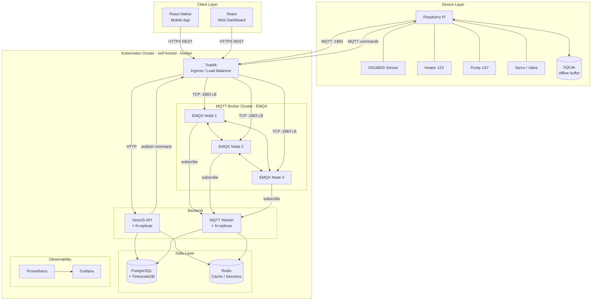

# IoTea
## Architektura


## Stos technologiczny

- Urządzenia IoT: Raspberry Pi, czujniki DS18B20, elementy wykonawcze 12V (grzałka, pompa) i 5V(zawór/serwo), lokalny bufor danych SQLite.
- Komunikacja: MQTT (EMQX cluster), HTTP/REST, HTTPS, Ingress i load balancing przez Traefik.
- Backend: NestJS API, worker(y) MQTT, uruchamiane jako replikowane usługi.
- Frontend: React (panel webowy), React Native (aplikacja mobilna).
- Dane: PostgreSQL + TimescaleDB (dane czasowe), Redis (cache/sesje), SQLite na warstwie edge/offline.
- Infrastruktura i deployment: Kubernetes (self-hosted), kontenery Docker.
- Observability: Prometheus, Grafana.

## Struktura repo

- [backend](backend) - NestJS API + MQTT worker + Prisma ORM
- [frontend](frontend) - React + Vite + Tailwind
- [mobile](mobile) - React Native (Expo + TypeScript)
- [k8s](k8s) - manifesty Kubernetes (base, addons, overlays)
- [RPi](RPi) - pliki Raspberry Pi
- [scripts](scripts) - skrypty automatyzujące

## Wymagania

- Node.js 22+
- npm
- Docker
- kubectl
- lokalny klaster Kubernetes (np. Docker Desktop)

## Uruchomienie lokalne (bez K8)

### Mobile (React Native)

```bash
cd mobile
npm install
npm run ios
# lub
npm run android
```

### Raspberry Pi

Work in Progress

## Kubernetes (DEV)

Szczegółowy opis deploymentu jest w [k8s/README.md](k8s/README.md).

Szybki start:

1. Dodaj host lokalny (opcjonalne):

```bash
echo "127.0.0.1 iotea.local" | sudo tee -a /etc/hosts
```
2. Budowanie obrazów lokalnych:

```bash
docker build -t iotea-frontend:latest ./frontend
docker build -t iotea-backend:latest ./backend
docker build -t iotea-worker-mqtt:latest -f ./backend/Dockerfile.worker ./backend
```

3. Zastosuj addony:

```bash
kubectl apply -k k8s/addons/traefik
kubectl apply -k k8s/addons/emqx
kubectl apply -k k8s/addons/redis
```

4. Zastosuj aplikację:

```bash
kubectl apply -k k8s/overlays/dev
```

## Automatyzacja deployu

Użyj skryptu [scripts/rebuild-deploy-dev.sh](scripts/rebuild-deploy-dev.sh):

```bash
./scripts/rebuild-deploy-dev.sh
```

Skrypt:

- buduje obrazy `iotea-frontend`, `iotea-backend`, `iotea-worker-mqtt`
- aplikuje overlay `k8s/overlays/dev`
- restartuje deploymenty
- czeka na rollout
- przy błędzie robi rollback deploymentów

Opcje:

```bash
./scripts/rebuild-deploy-dev.sh --help
./scripts/rebuild-deploy-dev.sh --skip-build
./scripts/rebuild-deploy-dev.sh --skip-apply
```

## Endpointy w środowisku K8 DEV

- Web: `http://iotea.local:30080/`
- API: `http://iotea.local:30080/api`
- Swagger: `http://iotea.local:30080/api/docs`
- API health: `http://iotea.local:30080/api/health`
- MQTT TCP: `iotea.local:31883`

## Uwagi

- Konfiguracja w [k8s/overlays/dev/secret.yaml](k8s/overlays/dev/secret.yaml) jest tylko do developmentu lokalnego.
- Sekrety DEV są jawne i nie nadają się do środowiska produkcyjnego.