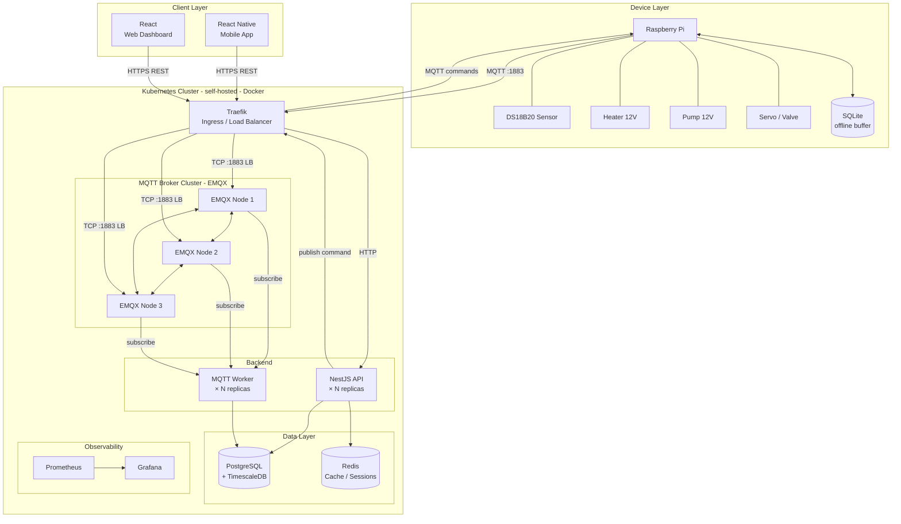

# IoTea
## Architektura

## Stos technologiczny

- Urządzenia IoT: Raspberry Pi, czujniki DS18B20, elementy wykonawcze 12V (grzałka, pompa) i 5V(zawór/serwo), lokalny bufor danych SQLite.
- Komunikacja: MQTT (EMQX cluster), HTTP/REST, HTTPS, Ingress i load balancing przez Traefik.
- Backend: NestJS API, worker(y) MQTT, uruchamiane jako replikowane usługi.
- Frontend: React (panel webowy), React Native (aplikacja mobilna).
- Dane: PostgreSQL + TimescaleDB (dane czasowe), Redis (cache/sesje), SQLite na warstwie edge/offline.
- Infrastruktura i deployment: Kubernetes (self-hosted), kontenery Docker.
- Observability: Prometheus, Grafana.