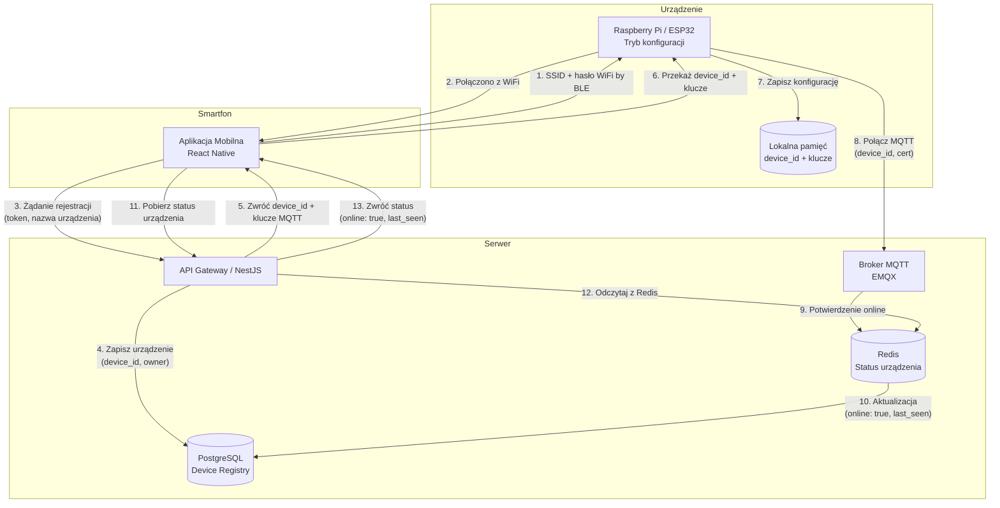

```mermaid
graph TD
    subgraph Urządzenie
        RPi[Raspberry Pi / ESP32<br/>Tryb konfiguracji]
        LOCAL[(Lokalna pamięć<br/>device_id + klucze)]
    end

    subgraph Smartfon
        APP[Aplikacja Mobilna<br/>React Native]
    end

    subgraph Serwer
        API[API Gateway / NestJS]
        DB[(PostgreSQL<br/>Device Registry)]
        REDIS[(Redis<br/>Status urządzenia)]
        MQTT[Broker MQTT<br/>EMQX]
    end

    %% KROK 1: KONFIGURACJA
    APP -- "1. SSID + hasło WiFi by BLE" --> RPi
    RPi -- "2. Połączono z WiFi" --> APP

    %% KROK 2: REJESTRACJA
    APP -- "3. Żądanie rejestracji<br/>(token, nazwa urządzenia)" --> API
    API -- "4. Zapisz urządzenie<br/>(device_id, owner)" --> DB
    API -- "5. Zwróć device_id + klucze MQTT" --> APP

    %% KROK 3: PRZEKAZANIE DO URZĄDZENIA
    APP -- "6. Przekaż device_id + klucze" --> RPi
    RPi -- "7. Zapisz konfigurację" --> LOCAL

    %% KROK 4: PIERWSZE POŁĄCZENIE MQTT + STATUS
    RPi -- "8. Połącz MQTT<br/>(device_id, cert)" --> MQTT
    MQTT -- "9. Potwierdzenie online" --> REDIS
    REDIS -- "10. Aktualizacja<br/>(online: true, last_seen)" --> DB

    %% ODCZYT STANU (opcjonalnie, ale pokazuje że działa)
    APP -- "11. Pobierz status urządzenia" --> API
    API -- "12. Odczytaj z Redis" --> REDIS
    API -- "13. Zwróć status<br/>(online: true, last_seen)" --> APP
```